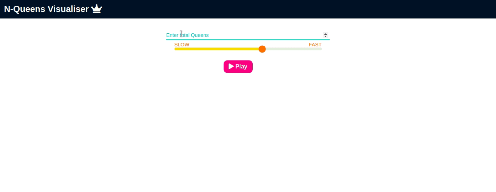

# N-Queens Puzzle Solver



**<p align='center'>You can find the website live <a href="https://nqueen.netlify.app/">here</a></p>**

## Table of Contents
- [Introduction](#introduction)
- [Features](#features)
- [Installation](#installation)
- [Usage](#usage)
- [Algorithm](#algorithm)
- [Contributing](#contributing)
- [License](#license)
- [Acknowledgements](#acknowledgements)

## Introduction
The N-Queens Puzzle is a classic computer science problem that involves placing N chess queens on an N×N chessboard so that no two queens threaten each other. This project provides a visual and interactive solution to the N-Queens Puzzle using a web-based interface.

## Features
- **Interactive Visualization**: Watch the algorithm solve the N-Queens Puzzle step-by-step.
- **Customizable Board Size**: Adjust the size of the chessboard to solve for different values of N.
- **Responsive Design**: The web interface is designed to work on various devices, including desktops, tablets, and smartphones.
- **Algorithm Explanation**: Detailed explanation of the recursive backtracking algorithm used to solve the puzzle.

## Installation
To run this project locally, follow these steps:

1. **Clone the repository**:
    ```bash
    git clone https://github.com/yourusername/n-queens-puzzle.git
    ```
2. **Navigate to the project directory**:
    ```bash
    cd n-queens-puzzle
    ```
3. **Open the `index.html` file in your browser**:
    ```bash
    open index.html
    ```

## Usage
1. Open the web interface.
2. Use the input field to set the size of the chessboard (N).
3. Click the "Solve" button to start the visualization.
4. Watch as the algorithm places the queens on the board.

## Algorithm
This project uses a recursive backtracking algorithm to solve the N-Queens Puzzle. The algorithm works as follows:

1. **Base Case**: If all queens are placed, return true.
2. **Recursive Case**:
    - Try placing a queen in all rows one by one.
    - For each placement, check if the queen can be placed without being attacked.
    - If placing the queen is safe, recursively try to place the rest of the queens.
    - If placing the queen leads to a solution, return true.
    - If placing the queen does not lead to a solution, backtrack and remove the queen.
3. If no placement leads to a solution, return false.

## Contributing
Contributions are welcome! Please follow these steps to contribute:

1. Fork the repository.
2. Create a new branch (`git checkout -b feature-branch`).
3. Make your changes.
4. Commit your changes (`git commit -m 'Add some feature'`).
5. Push to the branch (`git push origin feature-branch`).
6. Open a pull request.

## License
This project is licensed under the MIT License. See the [LICENSE](LICENSE) file for details.

## Acknowledgements
- Thanks to the contributors and the open-source community for their valuable inputs.
- Special thanks to the creators of the visualization libraries used in this project.